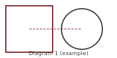

Lorem ipsum dolor sit amet.

## Universal section {#universal-section}

Lorem ipsum body.


Example one statement.
 See Theorem 1 above.

Example one definition.
 
Lorem ipsum remark.
 
Lorem ipsum proof body.


## Web only {#web-only}

Lorem ipsum web-only.

## PDF skipped {#pdf-skipped}

Lorem ipsum PDF-skipped.

## Word skipped {#word-skipped}

Lorem ipsum Word-skipped.

## Universal trailer {#universal-trailer}

Lorem ipsum trailer.
